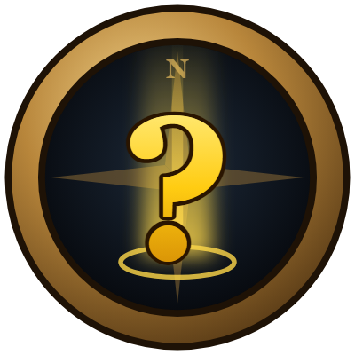
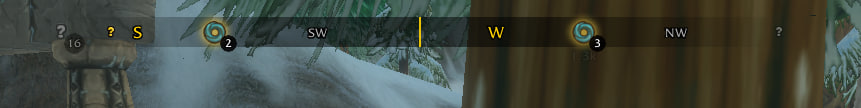
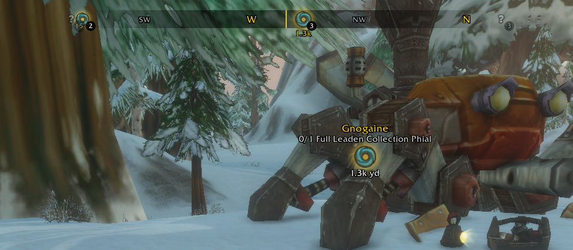
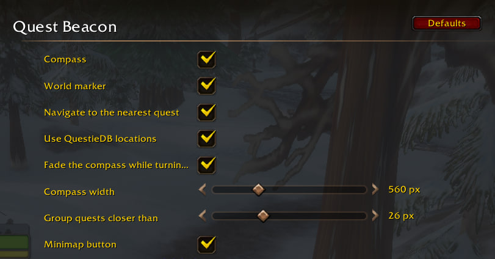

# Quest Beacon

WoW: Forever addon.

- **Compass bar** at the top of the screen with a pin for every tracked quest, at its direction, with the distance. Quests close together share one pin with a count; hover it for every quest, nearest first. Click a pin to navigate there; right-click it to drop that quest and go to the nearest other one. It turns with your character, and fades while you swing the camera with the left mouse button.
- **World marker** on the quest being navigated to: quest, next objective, distance. It replaces the game's own diamond, and sits under the rest of the interface.
- **Nearest first**: navigation switches to the nearest tracked quest as you move. A quest you pick yourself (in the quest tracker, on the compass, or with the key binding) is kept until it leaves your quest log.
- **Icons**: a yellow "?" for a quest ready to turn in, the dungeon or raid icon for a dungeon or raid quest still to do, a grey "?" for any other quest still to do.

Locations are the game's own quest areas. With [QuestieDB](https://github.com/Questie/QuestieDB) installed, the nearest spawn of whatever the quest still needs (or of whoever takes it in) is used instead, and navigation goes through a map waypoint on it. A quest with no location gets no pin.

The game places only one point in the 3D world for addons, so only one quest at a time gets a world marker. The compass covers the rest.

## Screenshots

The compass: grouped quests with their count, dungeon quests with the dungeon icon.

The world marker on the nearest quest, with its next objective and distance.

The settings page.

## Settings

Options → AddOns → Quest Beacon, or the minimap button (left-click: settings, right-click: compass on/off). The button works with minimap button collectors such as Leatrix Plus.

## Commands

- `/qb`: settings
- `/qb compass`, `/qb marker`, `/qb auto`: switch the compass, the world marker, nearest-first navigation on or off
- `/qb next`: navigate to the next tracked quest by distance (also a key binding under AddOns)
- `/qb move`: unlock the compass to drag it, again to lock
- `/qb why`: where each tracked quest is believed to be, and why

QuestMaster also picks which quest the game navigates to. Running both, turn off one of the two world markers.
